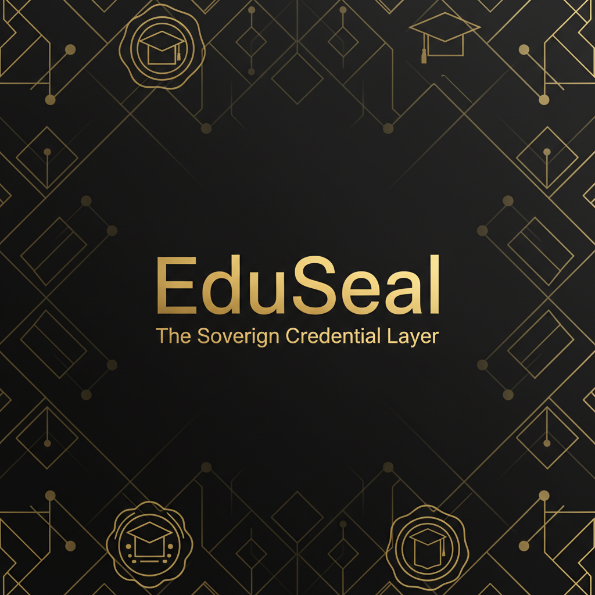

# EduSeal | The Sovereign Credential Layer



> **"The Black Card of Academia."**
>
> A zero-knowledge, sovereign identity protocol that allows users to self-mint academic credentials directly from institutional portals onto a private, immutable ledger.

[](https://opensource.org/licenses/MIT)
[](https://amoy.polygonscan.com/)
[](https://nextjs.org/)
[](https://reclaimprotocol.org/)
[](https://eliza.os/)

---

## 🏛️ The Vision

Talent is global, but verification is medieval. We still rely on PDF degrees, email confirmations, and slow institutional gatekeepers.

**EduSeal** flips the model. Instead of asking a university to issue a credential, the user **takes** it. Using ZK-TLS (Zero-Knowledge Transport Layer Security), users generate a cryptographic proof of their login session to portals like Canvas LMS. This proof is minted onto the Polygon blockchain as a non-transferable record.

The result is a **Private Ledger** of verified human capital—accessible instantly, trusted mathematically, and owned sovereignly.

---

## ⚡ Key Features

### 1. 🕵️‍♂️ The Shadow Mint (ZK-TLS)
Bypass the admin office. We use **Reclaim Protocol** to create a secure TLS tunnel to data sources (Canvas, LinkedIn, University Portals).
* **Privacy First:** Credentials are verified without revealing your login password or private cookies.
* **Sovereign:** You mint the proof. You own the record.

### 2. 📓 The Private Ledger (Dashboard)
A "Quiet Luxury" interface designed for high-value professionals.
* **Real-time Status:** "Green Dot" verification tracking directly from the blockchain.
* **Lazy Loading:** Optimized performance with Skeleton UI states.
* **Zero-Knowledge:** View your assets without exposing raw data publicly.

### 3. 🧠 The Concierge (AI Agent)
Integrated with **Eliza OS**, the Concierge is a local AI agent that acts as a natural language interface to the registry.
* *User:* "Do I have a verified Master's degree?"
* *Agent:* Queries Smart Contract -> "Yes, verified on Block #89201."

### 4. 🌍 The Talent Scout (Global Index)
A "Bloomberg Terminal" style command center for recruiters to discover verified talent.
* **Log Crawler:** Rebuilds the entire registry history by fetching `CredentialMinted` events from the chain.
* **Anonymized:** Identities are masked by wallet addresses until engaged.

---

## 🛠️ System Architecture

The "Hybrid Stack" combines Web2 Data, Web3 Storage, and AI Logic.

```mermaid
graph TD
    User[User] -->|1. Logins via TLS| Reclaim[Reclaim Protocol]
    Reclaim -->|2. Generates ZK Proof| Frontend[EduSeal dApp]
    Frontend -->|3. Mints Proof| Contract[EduSealRegistry.sol]
    Contract -->|4. Stores Data| Polygon[Polygon Amoy Blockchain]
    Recruiter[Recruiter] -->|5. Queries Logs| Contract
    Agent[Eliza AI] -->|6. Verifies Status| Contract

💻 Tech Stack
Frontend & Design
Framework: Next.js 14 (App Router)

Styling: Tailwind CSS (Custom "Quiet Luxury" Config)

Animation: Framer Motion

Connectivity: RainbowKit, Wagmi, Viem

Blockchain (The Laws)
Language: Solidity (Foundry Framework)

Network: Polygon Amoy Testnet

Standards: Custom Registry (Non-ERC20/721 for efficiency)

Intelligence (The Soul)
Engine: Eliza OS (TypeScript)

Plugin: Custom plugin-eduseal action handler

🚀 Getting Started
Prerequisites
Node.js v18+

Pnpm (Package Manager)

Metamask or Rainbow Wallet

Reclaim Protocol Mobile App (for QR Scanning)

1. Installation
Clone the repository and install the "Monorepo" dependencies:
git clone [https://github.com/YOUR_USERNAME/eduseal.git](https://github.com/YOUR_USERNAME/eduseal.git)
cd eduseal
pnpm install

2. Environment Configuration
Create a .env.local file in the root directory:
# WalletConnect Project ID (Get from cloud.walletconnect.com)
NEXT_PUBLIC_WALLETCONNECT_PROJECT_ID=your_id_here

# Reclaim Protocol Credentials (Get from dev.reclaimprotocol.org)
NEXT_PUBLIC_RECLAIM_APP_ID=your_app_id
NEXT_PUBLIC_RECLAIM_APP_SECRET=your_app_secret

# Alchemy/Infura RPC (Optional for better speed)
NEXT_PUBLIC_ALCHEMY_KEY=your_alchemy_key

# Smart Contract Address (Pre-filled if using our deployment)
NEXT_PUBLIC_REGISTRY_CONTRACT_ADDRESS=0x...

3. Running the App
Start the development server:
pnpm dev
Visit http://localhost:3000 to see the application.⛓️ Smart ContractsThe EduSealRegistry is the source of truth. It maps user addresses to an array of verified credential structs.Contract NameNetworkAddressVerificationEduSealRegistryPolygon Amoy0x...View on PolygonScanDeploying Your OwnIf you want to deploy a fresh registry:
# Inside /contracts folder
forge script script/Deploy.s.sol:DeployScript --rpc-url <AMOY_RPC> --private-key <YOUR_KEY> --broadcast

🧪 Testing
We adhere to a rigorous testing standard (A+ Audit Grade).

Unit Tests (Frontend):
pnpm test
# Runs Vitest on Dashboard, ShadowMint, and Wallet components

End-to-End Tests:
pnpm test:e2e
# Runs Playwright to verify critical user flows

📂 Project Structure
eduseal/
├── src/
│   ├── app/              # Next.js App Router Pages
│   ├── components/       # UI Components (ShadowMint, Sidebar)
│   ├── eliza/            # AI Agent Logic & Actions
│   └── lib/              # Utilities (Wagmi config, Utils)
├── contracts/            # Foundry Smart Contract Project
│   ├── src/              # Solidity Source Code
│   └── script/           # Deployment Scripts
├── public/               # Static Assets (Manifest, Icons)
├── tests/                # E2E Playwright Tests
└── README.md             # You are here

⚠️ Important Note: The AI Agent
The "Concierge" AI feature (powered by Eliza) runs on a local server instance for this hackathon demo.

In the Live Demo: You will see the UI and Blockchain interactions working perfectly.

In the Video: You will see the full integration with the local AI Agent answering queries.

📜 License
This project is open-source and available under the MIT License.

EduSeal — Sovereignty. Verified.
